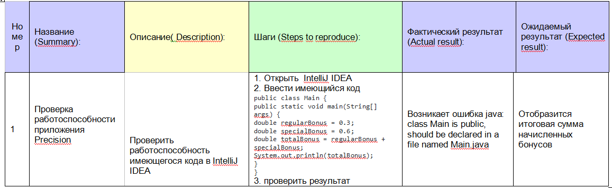

# Отчёт о тестировании Precision

## Краткое описание

11.05.2021 - 11.05.2021 было проведено Было проведено функциональное тестирование, тестирование белого ящика. 

На тестирование затрачено: 30 мин

В результате тестирования выявлены следующие дефекты:
* [Некорректный рассчет итогового бонуса клиента ](https://github.com/netology-Marina/Precision/issues/1)

## Описание процесса тестирования

В процессе тестирования использовались следующие артефакты:

* [Чек-лист](D:\Precision\check list.md)
* [тест-кейс](D:\Precision\test case.md)

  
* тест-кейс

В качестве тестовых данных использовались данные:
* код:
  
  public class Main {
  public static void main(String[] args) {
  double regularBonus = 0.3;
  double specialBonus = 0.6;
  double totalBonus = regularBonus + specialBonus;
  System.out.println(totalBonus);
  }
  }

Тестирование производилось в следующем окружении:
* ОС - х64
* версия Java -11
* IntelliJ IDEA
